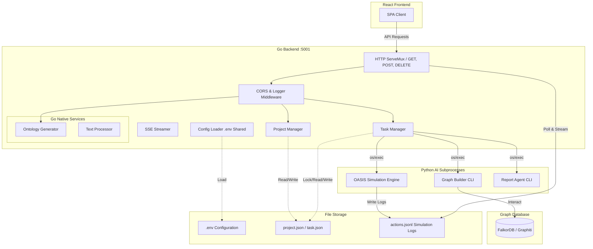

# MiroFish Go 백엔드 포팅 계획 (Porting Plan)

본 문서는 파이썬 기반의 기존 MiroFish 백엔드(`/backend`)를 Go 백엔드(`/backend_go`)로 포팅하기 위한 아키텍처 설계, 컴포넌트 매핑, 데이터 호환성 보장 방안 및 단계별 개발 마일스톤을 기술합니다.

---

## 1. 아키텍처 개요 (Hybrid Go-Python Architecture)

MiroFish는 **FalkorDB + Graphiti** 기반의 지식 그래프(Knowledge Graph) 구축과 **Camel-OASIS** 소셜 에이전트 시뮬레이션이라는 고도로 복잡하고 특화된 Python AI 프레임워크 라이브러리에 강하게 의존하고 있습니다.

이러한 핵심 AI 라이브러리를 Go 언어로 바닥부터 완벽히 재구현하는 것은 실질적으로 불가능하며 버그 발생의 위험이 큽니다. 따라서 성능과 안전성, 개발 생산성을 모두 잡기 위해 다음과 같은 **하이브리드(브릿지) 아키텍처**를 채택합니다.



### 핵심 설계 방향
1. **API 게이트웨이 및 웹 컨트롤러 국산화**: REST API 라우팅, 요청 검증, CORS 처리, 로깅, 파일 업로드, 파일 기반 상태 관리(프로젝트 및 비동기 태스크)는 **Go 언어로 100% 네이티브 개발**합니다.
2. **설정 파일 및 스토리지 공유**: 프로젝트 루트의 `.env` 파일 및 기존 `uploads/` 디렉터리 내 파일 구조(`projects/`, `tasks/`, `simulations/`)를 파이썬 백엔드와 완전히 공유하여 프론트엔드가 인지하지 못할 정도의 완벽한 하위 호환성을 유지합니다.
3. **핵심 AI 비즈니스 로직 브릿지**: `camel-oasis` 시뮬레이션 구동 및 `graphiti` 지식 그래프 빌드, `ReportAgent` 구동 등은 Go의 `os/exec` 패키지를 통해 파이썬 진입점(CLI 명령어)을 기동하고, 파일 기반 상태 공유 또는 IPC 통신을 통해 모니터링합니다.

---

## 2. 기술 스택 & Go 디자인 원칙

`golang-code-style` 및 `golang-design-patterns` 스킬의 가이드라인에 따라 불필요한 의존성을 최소화하고 Go답고 깔끔한 코드를 작성합니다.

- **Go Version**: `1.26` 이상
- **Web Router**: **Go 1.22+ 표준 `net/http` ServeMux** 사용 (외부 라우터 의존성 배제)
  - `GET /api/project/{project_id}` 등 와일드카드 및 경로 파라미터 매칭 표준 기능 활용
- **JSON Handling**: Go 표준 `encoding/json` 패키지 사용
- **Configuration**: 환경변수(`.env`) 파서 구현 (표준 라이브러리 기반 혹은 최소한의 로더 작성)
- **Concurrency & Resource Management**:
  - `syscall.Flock`을 활용한 파일 락 구현 (TaskManager의 동시성 안전 보장)
  - 채널(channel)과 고루틴(goroutine)을 활용하여 비동기 실행 및 타임아웃 감시
  - `defer` 블록을 활용하여 리소스(파일 핸들러 등)의 지연 정리 철저화

---

## 3. 프론트엔드 API 규약 분석 및 매핑

프론트엔드와 기존 파이썬 백엔드 간의 규약이 깨지지 않도록 아래의 API 핸들러들을 완벽히 매핑합니다.

| 분류 | API 엔드포인트 | HTTP Method | Go 백엔드 구현 방식 | 설명 |
| :--- | :--- | :---: | :--- | :--- |
| **Health** | `/health` | GET | Native Go | 서비스 상태 확인 |
| **Project** | `/api/graph/project/<id>` | GET/DELETE | Native Go | 프로젝트 메타데이터 로드 및 삭제 |
| | `/api/graph/project/list` | GET | Native Go | 프로젝트 목록 조회 (생성일 역순) |
| | `/api/graph/project/<id>/reset` | POST | Native Go | 프로젝트 빌드 상태 리셋 |
| **Ontology**| `/api/graph/ontology/generate` | POST | Native Go | 파일 업로드 수신, 텍스트 추출, LLM 질의 및 온톨로지 생성 |
| **Graph** | `/api/graph/build` | POST | Hybrid Bridge | 비동기 그래프 빌드 시작 (Python CLI 호출) |
| | `/api/graph/task/<id>` | GET | Native Go | 그래프 빌드 등 비동기 태스크 상태 조회 |
| | `/api/graph/tasks` | GET | Native Go | 모든 태스크 목록 조회 |
| | `/api/graph/data/<graph_id>` | GET | Native Go / DB Query | FalkorDB 직접 조회 혹은 Python 어댑터 경유 |
| | `/api/graph/delete/<graph_id>` | DELETE | Native Go / DB Query | FalkorDB 데이터 정리 |
| **Simulation**| `/api/simulation/create` | POST | Native Go | 시뮬레이션 설정 파일 디렉터리 및 UUID 생성 |
| | `/api/simulation/prepare` | POST | Native Go / LLM | 에이전트 프로필 생성 및 시뮬레이션 환경 준비 |
| | `/api/simulation/start` | POST | Hybrid Bridge | OASIS 시뮬레이션 서브프로세스 기동 (`run_parallel_simulation.py`) |
| | `/api/simulation/stop` | POST | Hybrid Bridge | 시뮬레이션 중지 (프로세스 그룹 Kill) |
| | `/api/simulation/<sim_id>/run-status`| GET | Native Go | `run_state.json` 로드 및 상태 반환 |
| | `/api/simulation/<sim_id>/actions`| GET | Native Go | `actions.jsonl` 파일에서 에이전트 행적 조회 |
| | `/api/simulation/interview` | POST | Native Go / LLM | 특정 에이전트 롤플레이 인터뷰 수행 |
| **Report** | `/api/report/generate` | POST | Hybrid Bridge | 리포트 생성 에이전트 기동 (`report_agent.py` 연동) |
| | `/api/report/<id>/console-log/stream` | GET | Native Go (SSE) | Server-Sent Events 기반 생성 로그 스트리밍 |

---

## 4. 데이터 저장 및 공유 모델 설계

파이썬 백엔드가 사용하던 로컬 파일 기반 상태 지속성(State Persistence)을 그대로 이어받아 공유합니다.

### 4.1. 프로젝트 데이터 구조 (`project.json`)
경로: `uploads/projects/{project_id}/project.json`
```json
{
  "project_id": "proj_xxxx",
  "name": "Project Name",
  "status": "ontology_generated",
  "created_at": "2026-06-27T12:00:00Z",
  "updated_at": "2026-06-27T12:05:00Z",
  "files": [
    {
      "original_filename": "source.txt",
      "saved_filename": "uuid.txt",
      "path": "uploads/projects/proj_xxxx/files/uuid.txt",
      "size": 12345
    }
  ],
  "total_text_length": 12345,
  "ontology": {
    "entity_types": [],
    "edge_types": []
  },
  "analysis_summary": "Summary text from LLM...",
  "graph_id": "mirofish_xxxx",
  "graph_build_task_id": "task_uuid_xxxx",
  "simulation_requirement": "Deduce the public opinion trajectory..."
}
```

### 4.2. 태스크 데이터 구조 (`{task_id}.json`)
경로: `uploads/tasks/{task_id}.json`
- 파일 락(`syscall.Flock`)을 이용하여 다중 프로세스/스레드 간 읽고 쓰기 동시성을 보호합니다.

### 4.3. 시뮬레이션 상태 및 행적
- **시뮬레이션 실행 상태**: `uploads/simulations/{simulation_id}/run_state.json`
- **에이전트 행적 파일**: `uploads/simulations/{simulation_id}/{platform}/actions.jsonl`
  - Go 백엔드는 고루틴을 통해 해당 파일들의 변화를 감지하고 스트리밍합니다.

---

## 5. 포팅 상세 구현 전략

### 5.1. 설정 로더 및 유효성 검증
Go는 컴파일 기반의 강력한 타입 체크를 수행하므로, 프로그램 기동 시 설정 정보 유효성 검사(`validate`)를 실행하여 필수 환경변수가 누락된 경우 즉시 종료합니다.

```go
type Config struct {
	LLMAPIKey      string `env:"LLM_API_KEY"`
	LLMBaseURL     string `env:"LLM_BASE_URL"`
	LLMModelName   string `env:"LLM_MODEL_NAME"`
	GraphDBHost    string `env:"GRAPH_DB_HOST"`
	GraphDBPort    int    `env:"GRAPH_DB_PORT"`
	SecretKey      string `env:"SECRET_KEY"`
	Debug          bool   `env:"FLASK_DEBUG"`
	// ... 기타 설정 필드
}
```

### 5.2. 태스크 매니저의 파일 락 (Unix syscall.Flock)
기존 파이썬 코드는 `fcntl.flock`을 활용해 타일 기반 락을 제어했습니다. Go에서는 다음과 같이 운영체제 시스템 콜을 래핑하여 에러 우선 리턴 구조로 구현합니다.

```go
func (tm *TaskManager) LockAndMutate(taskID string, mutator func(*Task) error) error {
	lockPath := tm.getLockPath(taskID)
	file, err := os.OpenFile(lockPath, os.O_CREATE|os.O_WRONLY, 0666)
	if err != nil {
		return fmt.Errorf("open lock file: %w", err)
	}
	defer file.Close()

	// Exclusive Lock (Blocking)
	if err := syscall.Flock(int(file.Fd()), syscall.LOCK_EX); err != nil {
		return fmt.Errorf("acquire lock: %w", err)
	}
	defer syscall.Flock(int(file.Fd()), syscall.LOCK_UN)

	// 태스크 파일 로드, 변형, 저장 수행...
	return nil
}
```

### 5.3. 비동기 프로세스 실행 브릿지 (os/exec)
OASIS 시뮬레이션 실행 시 Go 백엔드가 자식 프로세스를 기동하고 프로세스 ID(PID)를 상태에 기록합니다.

```go
func StartSimulationProcess(simID string, scriptName string, configPath string) (int, error) {
	cmd := exec.Command("python3", filepath.Join("scripts", scriptName), "--config", configPath)
	
	// Unix 환경에서는 새로운 프로세스 그룹으로 지정하여 차후 자식들의 연쇄 Kill 보장
	cmd.SysProcAttr = &syscall.SysProcAttr{Setpgid: true}
	
	// 로그 출력을 simulation.log 파일에 파이프핑
	logFile, err := os.OpenFile(filepath.Join("uploads/simulations", simID, "simulation.log"), os.O_CREATE|os.O_WRONLY|os.O_TRUNC, 0666)
	if err != nil {
		return 0, err
	}
	cmd.Stdout = logFile
	cmd.Stderr = logFile

	if err := cmd.Start(); err != nil {
		logFile.Close()
		return 0, err
	}
	
	// 비동기 모니터링 고루틴 구동
	go func() {
		defer logFile.Close()
		cmd.Wait()
		// 프로세스 종료에 따른 상태 전환 로직 수행
	}()

	return cmd.Process.Pid, nil
}
```

---

## 6. 포팅 마일스톤 및 액션 플랜 (Milestones)

포팅 프로세스는 프론트엔드 연동 흐름에 맞춰 **4단계**로 나누어 진행합니다.

```mermaid
gantt
    title MiroFish Go 포팅 마일스톤
    dateFormat  YYYY-MM-DD
    section 준비 & 설정
    1단계: 개발 환경 구성 및 설정 로더 구축  :active, des1, 2026-06-28, 3d
    section API 포팅
    2단계: 프로젝트 & 온톨로지 API 포팅       : des2, after des1, 5d
    3단계: 그래프 빌드 & FalkorDB 브릿징     : des3, after des2, 5d
    4단계: 시뮬레이션 & 리포트 에이전트 포팅   : des4, after des3, 7d
```

### 6.1. [1단계] 준비 및 공통 유틸리티 (3일)
* [ ] `/backend_go` 내에 `main.go`, `config/`, `utils/`, `models/` 기본 디렉터리 레이아웃 생성
* [ ] `.env` 설정 로더 및 유효성 검사 로직 작성
* [ ] 다국어 번역 리소스 연동을 위한 locale 로직 포팅
* [ ] 로깅 미들웨어 및 CORS 처리 핸들러 구축

### 6.2. [2단계] 프로젝트 및 온톨로지 생성 API (5일)
* [ ] `Project` 및 `ProjectManager` 포팅 (로컬 JSON 입출력 구현)
* [ ] PDF/MD/TXT 파일 수신 및 텍스트 추출 핸들러 구현 (Go PDF 파서 라이브러리 검토 혹은 Python 래퍼 스크립트 작성)
* [ ] `OntologyGenerator` 포팅 (Go OpenAI SDK를 통한 온톨로지 생성 및 스키마 검증)
* [ ] REST API 매핑 및 연동 테스트

### 6.3. [3단계] 그래프 빌드 및 DB 연동 (5일)
* [ ] `TaskManager` 및 파일락 시스템 구현
* [ ] Graphiti 연동 브릿지 구현 (Go에서 Python Graphiti 모듈을 CLI 인터페이스로 기동하는 배치 추가)
* [ ] FalkorDB 노드/에지 조회 Native Go 구현
* [ ] 그래프 데이터 시각화용 JSON 응답 API 완성

### 6.4. [4단계] 시뮬레이션 및 리포트 에이전트 (7일)
* [ ] `SimulationRunner` 및 `SimulationManager` 포팅 (OASIS Python 스크립트 비동기 구동 및 PID 제어)
* [ ] `actions.jsonl` 파일 추적 및 프론트엔드용 통계 API 포팅
* [ ] SSE(Server-Sent Events) 스트리밍 기능 추가 (보고서 생성 콘솔 로그 및 에이전트 로그)
* [ ] 롤플레이 에이전트 인터뷰 API 포팅
* [ ] 전체 통합 테스트 및 프론트엔드 연동 검증

---

## 7. 향후 고려사항 및 제약 사항

1. **Python Virtualenv 의존성**: `exec.Command` 호출 시 사용자의 로컬 파이썬 가상환경(`.venv`)의 파이썬 인터프리터 경로를 정확히 호출해야 에러가 발생하지 않습니다. 가상환경 내 `bin/python`을 찾아 실행하는 동적 탐색 로직을 추가합니다.
2. **다국어(Locale) 파일 공유**: 번역 문자열(locale) 관리는 기존 프로젝트의 JSON/YAML 리소스를 그대로 바라보도록 설계하여 설정 및 유지보수를 일원화합니다.
3. **SSE 버퍼 처리**: Nginx 등 리버스 프록시를 사용할 경우 SSE 응답이 버퍼링될 수 있으므로 `X-Accel-Buffering: no` 헤더를 Go 응답 헤더에 명시적으로 추가합니다.
